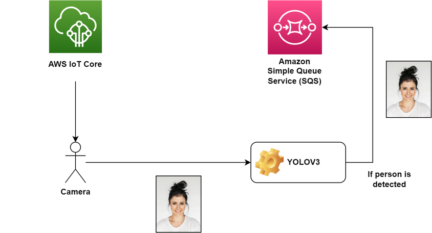
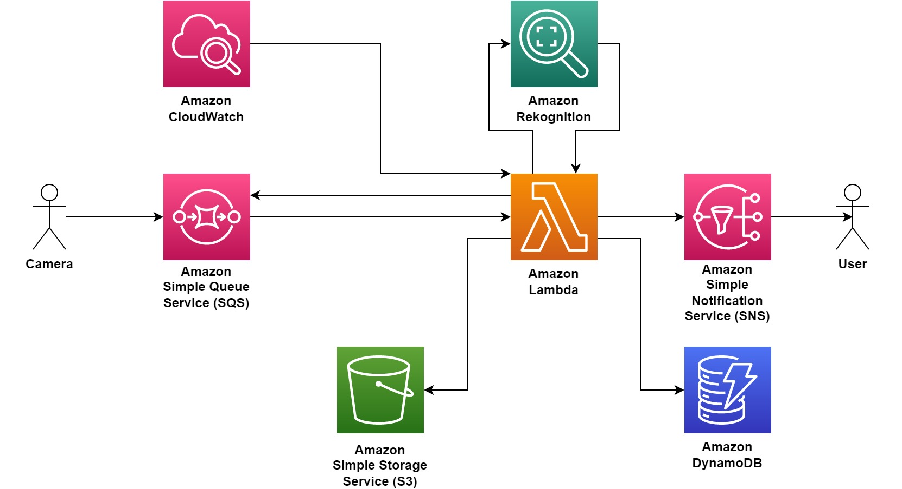

# SkyWatch
**Software architecture for image classification and storage with AWS and ESP32-CAM.**

This document provides an overview of an image processing pipeline, which is responsible for processing images received in 64-bit format via an Amazon SQS Queue. 
The pipeline uses various AWS services such as Amazon CloudWatch Events, AWS Lambda, Amazon Recognition, Amazon DynamoDB, and Amazon S3 to process and store images, detect people, and notify subscribed users.

This repository contains the code and configuration files for an ESP32-CAM-based camera system. 
The ESP32-CAM captures images and streams the output to a YOLOv3 (You Only Look Once version 3) server. 
YOLOv3 is responsible for real-time object detection in the incoming camera feed. Once objects are detected, 
the YOLOv3 server processes this information and publishes the results, along with the images, to the AWS Queue.

## Hardware Prerequisites

- USB to TTL adapter
- ESP32-CAM

## Components

### Amazon SQS Queue

- Images are received in 64-bit format through an Amazon Simple Queue Service (SQS) Queue.
  
### Amazon CloudWatch Event

- A schedule is set in Amazon CloudWatch Events to trigger the image processing workflow at certain time intervals.
  
### Amazon Lambda Function

- An AWS Lambda Function is invoked by the CloudWatch Event trigger.
- The Lambda Function decodes the incoming image and calls Amazon Recognition to determine if a person is detected in it.
  
### Amazon Recognition

- Amazon Recognition is used for image analysis and person detection.
- If a person is detected in the image, the results are stored in an Amazon DynamoDB Table.
  
### Amazon DynamoDB Table

- The results from the Amazon Recognition analysis are saved in an Amazon DynamoDB Table for future reference and analysis.
  
### Amazon S3 Bucket

- If a person is detected, the image is saved in an Amazon S3 Bucket.
- The image in the S3 Bucket is made accessible via a link that is valid for 24 hours.
  
### Email Notification

- Subscribed users receive an email notification containing the link to access the processed image.
